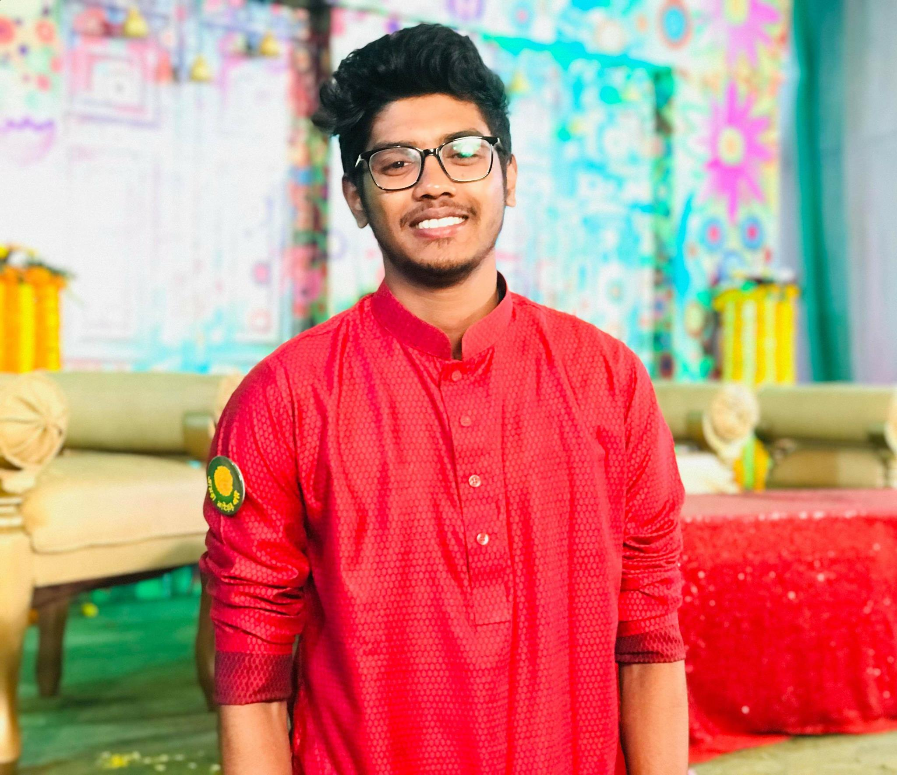

<!DOCTYPE html>
<html>
<head>
<title>Resume of Abu Saleh </title>
	
	 
</head>
<body>
	

		

                 
                
<b> Abu Saleh Md. Boni Momin </b>   
                	 
                		<b>Robotics Engineer</b>  
                	   Student of Computer Science and Engineering  
                	<b>United International University</b> 
                    <button class="block"> <a href="https://www.facebook.com/momin.win.200218" target="_blank"> Facebook of Momin Win </button>  </a>  
                  	<button class="block"> <a href="https://github.com/mominwin" target="_blank"> Github </button>  </a> 
                  		<button class="block"> <a href="https://www.instagram.com/mominwin/" target="_blank"> Instagram </button>  </a>  
                  		 <b>Address:</b> House 15, Road 2, Shyamoli, Dhaka-1207. 
                  		 <b>E-mail:</b> amomin193076@bscse.uiu.ac.bd
              
          
 
      

       
       
      	

           
 <h2 align="center"><b>Education</b></h2> 
  
                <table align="center" width="85%" bgcolor="lightgrey" border="0">
              <tr>
                  <th style="font-size: 30"><u> Degree</u></th>
                  <th style="font-size: 30"><u>Instritution</u></th>
                  <th style="font-size: 30"><u>Year</u></th>
                  <th style="font-size: 30"><u>GPA</u></th>
              </tr>
              <tr>
                  <th>SSC</th>
                  <th>Government Laboratory High School</th>
                  <th>2015</th>
                  <th>5.00</th>
              </tr>      
              <tr>
                  <th>HSC</th>
                  <th>Dhaka City College</th>
                  <th>2017</th>
                  <th>5.00</th>
              </tr>
              <tr>
                  <th>BSc in Civil Engineering</th>
                  <th>Ahsanullah University of Science and Technology</th>
                  <th>2017-2019(Incomplete)</th>
                  <th>3.60 (60 credits)</th>
              </tr>
              <tr>
                  <th>BSc in CSE</th>
                  <th>United International University</th>
                  <th>1st semester(Currently Studying)</th>
                  <th>N/A</th>
              </tr>
            </table>
        

     
    
    

            
<h2 align="center"><b>Skills</b></h2> 

       <ul>
        <li align="left">Hardware and Sensors interaction of Robots</li>
        <li align="left">Hardware Programming of Robots</li>
        <li align="left">Mechanical Designing of Robots</li>
        <li align="left">Programming in C and python</li>
        <li align="left">Highly Efficient in Rasperry pi, Arduino</li>
        <li align="left">Presentaion in both English and Bengali</li>
        <li align="left">Diplomacy and Communication</li>
        <li align="left">Event Organizing</li>
        <li align="left">Highly efficient in Microsoft powerpoint and Word</li>
        <li align="left">Anchoring</li>
    </ul>
        
  

        

            
 <h2 align="center"><b>Work Experience</b></h2>

    <ul>
        <li align="left">President of <a href="https://www.facebook.com/opmlt/" target="_blank">Optimus Prime MLT</a> <b>(Currently Working)</b></li>
        <li align="left">Inventor of <u>Cranial Control Wheelchair(Robot)</u></li>
        <li align="left">Inventor of <u>Electrochair(Robot)</u></li>
        <li align="left">Inventor of <u>Doctor's Assistant(Robot)</u></li>
        <li align="left">Inventor of <u>Poltry Farm Management System in Bangladesh(Robot)</u></li>
        <li align="left">Created <b> 3 line followers, 1 Soccer Robot, 1 Battle Robot, 1 industrial robot</b></li>
        <li align="left">ex AUST's Campus Ambassador of <b>Technocracy(RUET) Competition</b> </li>
        <li align="left">ex AUST's Campus Ambassador of <b>Largest Tech Festival in ASIA, 'Techfest IIT, Bombay of 2019-2020'</b> Competition </li>
        <li align="left">ex AUST's Campus Ambassador of Kandari(a non profit charity foundation) </li>
        <li align="left">Global Volunteer of <b> AIESEC, United Nation </b> (executed a project in indonesia in 2019) </li>
        <li align="left">Organizer of <b> Innobotics, UIU</b> </li>
    </ul>
           

           
   

        
            
 <h2 align="center"><b>Awards</b></h2> 
 
    <ul>
    	<li align="left"><i> Champion</i> on Bangladesh Zonal of VISION 2030 Robotics Project of <b> Techfest Bandladesh Zonal</b></li>
    	<li align="left"><i> 3rd</i> in ASIA of VISION 2030 Robotics Project of <b> Techfest IIT, Bombay 2018-2019</b></li>
    	<li align="left"><i> Runner-up</i> of Bangladesh's first robotics based reality show  channel i- gph ispat <b>'ESHO ROBOT BANAI </b></li>
        <li align="left"><i>Champion</i> on Hardware of <b>Mindsparks 2019, AUST</b></li>
        <li align="left"><i>Champion</i> on Project Showcasing of <b>BUET EEE-day 2019, BUET</b></li>
        <li align="left"><i>Champion</i> on Project Showcasing of <b>BUET CSE fest 2019, BUET</b></li>
        <li align="left"><i>Champion</i> on Project Showcasing of <b>DU Fab Fest 2018, Dhaka University</b></li>
        <li align="left"><i>Runner-up</i> on Project Showcasing of <b>3rd IEEE Student Conference, Dhaka University</b></li>
        <li align="left"><i>2nd Runner-up</i> of RoboRace of <b>3rd IEEE Student Conference, Dhaka University</b></li>
        	<li align="left"><i>Champion</i> on Project Showcasing of <b>IUB EEE day 2019, IUB</b></li>
        	<li align="left"><i>1st Runner-up</i> on Project Showcasing of <b>Technocracy 2019, RUET</b></li>
        <li align="left"> 3rd best Bangladeshi Volunteer of <b> AIESEC, UN </b> </li>
        <li align="left"><i>Champion</i> on quiz Competition <b>ICDDR'B annual fest, 2009</b></li>
    </ul>
    

            
<h2 align="center">Hobby</h2> 

            <ul>
        <li align="left">Traveling</li>
        <li align="left">Gaming</li>
        <li align="left">Robotics</li>
        <li align="left">Progamming</li>
        <li align="left">Reading Books</li>
    </ul>
        
  

       
    
    

           
 <h2 align="center">Memorable Day</h2> 

   
<h4 style="text-align:center; border: 5px solid black; padding: 20px;"> The Memorable day of my life is that day me and my team became the runner up in the Bangladesh's First National Robotics Based Reality Show <b> 'ESHO ROBOT BANAI' </b>. I sacrificed everything in those 3 months before that competition's grand finale which was on 26th July, 2019. And Finally I got my reward. I received the honor from our ICT ministry, Sir Zunaid Ahmed Palak. It's hard to describe the struggle, sacrifices and those sleepless nights. Alhamdullillah, on that day the entire nation saw me in Television as a national champion and the feelings was undescribalbe.   
   	
 </h4>
 

<h1 style="text-align: center"> THANK YOU for the visit </h1>
</body>
</html>
